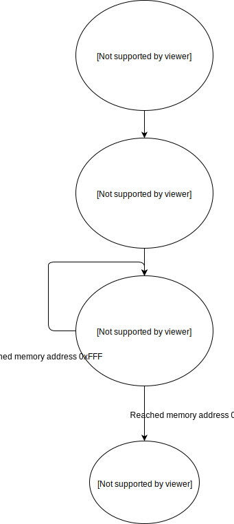

# Engine

## What is this document?

This document describes how our CHIP-8 engine is built, how the CHIP-8
environment (the data registers, timers, etc) is managed and how it interprets
given instructions.

## Abstract

What we mean by "Engine" is the component of our interpreter that is in charge
of providing the necessary core utilities to interpret given instructions. In
order to reach a such goal, we need a way to represent the CHIP-8 environment
and interact with it.

Here's a diagram to outline how the engine works:



## Representing the CHIP-8 environment

The CHIP-8 environment is composed of memory, registers and timers for
instance. The engine embodies this by being able to generate a data structure
that represents the CHIP-8 environment. All instructions will acts on this data
structure, and thus having an effect on the CHIP-8 environment.

Here's an implementation agnostic representation of the data structure in
question:

```
#              # -> Comment
{ key: value } # -> Map
[]             # -> Sequence (list, array, ...)
abc            # -> Keyword (unique identifier)
uint           # -> Unsigned Integer

{
  data: [
    <8-bit uint>, # Register 0
    <8-bit uint>, # Register 1
    <8-bit uint>, # Register 2
    <8-bit uint>, # Register 3
    <8-bit uint>, # Register 4
    <8-bit uint>, # Register 5
    <8-bit uint>, # Register 6
    <8-bit uint>, # Register 7
    <8-bit uint>, # Register 8
    <8-bit uint>, # Register 9
    <8-bit uint>, # Register A
    <8-bit uint>, # Register B
    <8-bit uint>, # Register C
    <8-bit uint>, # Register D
    <8-bit uint>, # Register E
    <8-bit uint>  # Register F
  ],
  I: <16-bit uint>,
  timer: <8-bit uint>,
  sound: <8-bit uint>,
  memory: [
    <8-bit uint> * 4096
  ],
  pc: <16-bit uint>,
  pointer: <8-bit uint>,
  stack: [
    <16-bit uint> * 16
  ],
  display: [
    [<1-bit uint> * 64] * 32
  ],
  keypad: [<1-bit uint> * 16]
}
```

This part of the engine should produce a data structure that looks like this
with all values initialized at 0.

We will sometimes refer to the "current engine state". By this term with refer
current state if this data structure.

This gives us the base of our CHIP-8 environment, but it is still quite empty.
The next part of our engine should enables us to modify this new environment
into one that is ready to execute instructions.

_Note:_ In the original implementation of the CHIP-8 language, everything was
stored in the engine's memory, including the registers, the stack, timers, ...
The memory looked like so:
 * `0x000 - 0x200 (512 bytes)` - Interpreter private space (registers, font,
   ...)
 * `0x200 - 0xE9F (3232 bytes)` - CHIP-8 program
 * `0xEA0 - 0xEFF (96 bytes)` - Stack, internal use and other variables
 * `0xF00 - 0xFFF (256 bytes)` - Display

As we're not in an environment were we may suffer of resource scarcity, we do
not need to stick to this memory layout. We can enable the user to store more
CHIP-8 code than he could before, we do so.

## Filling up the environment

A such environment that is ready to read instructions has to comply to having:
 * The first 80 bytes of memory , from `0x000` to `0X04F`, filled with the
   built-in CHIP-8 font
 * CHIP-8 program stored in memory, starting at address `0x200` to the end,
   `0xFFF`
 * Program counter set to point to address `0x200`
 * Everything else should have a value of `0`

If the engine data structure fills this requirements, it is then ready to
execute its stored CHIP-8 program. This happens in the "cycle".

## Cycle

The cycle is the part of the engine that is in charge of really interpreting
the instructions of a given CHIP-8 program.
One cycle reads and execute one instruction. That means that a cycle should
read the instruction that the program counter is pointing to, call the
subroutine corresponding to the read instruction (using the instruction set
module), generating a new engine state derived from the one at the beginning of
the cycle, decrement the timer and sound timer if they're not equal to 0 and
increment the program counter so that the next cycle will read the next
instruction.
A cycle should end itself by returning a new engine state that takes into
account these modifications.
