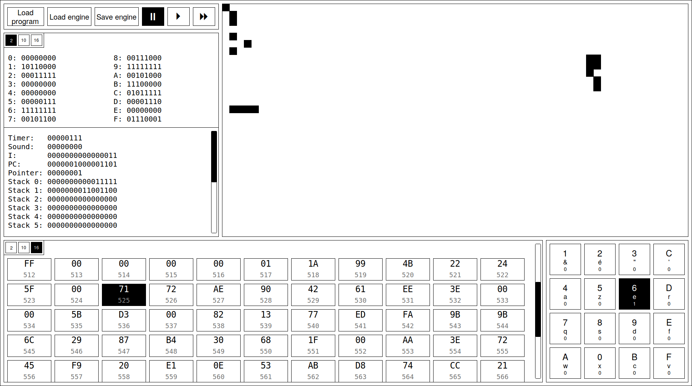
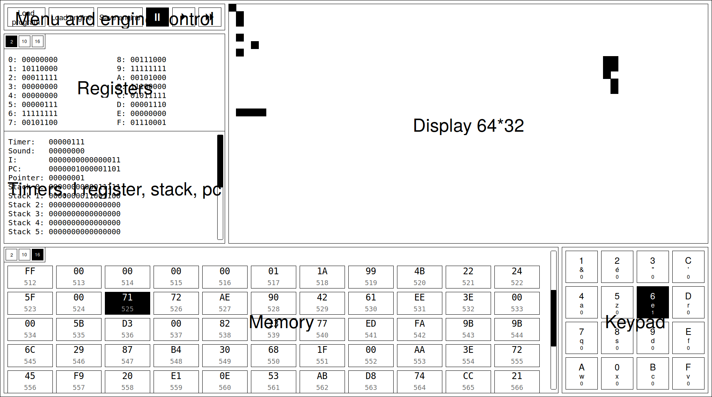

# Graphical User Insterface

## What is this document?

The purpose of this document is to describe how is arranged the graphical
interface of our CHIP-8 interpreter and how the user will interact with it.

## Abstract

Let's define what is a GUI and why we need one.

### What is a GUI?

A Graphical User Interface, GUI, is the part of a software that the end user
uses to interact with the back-end of this software. It takes the form of a
suite of data displayed on a screen with a defined layout, with buttons and
text boxes (for instance) to let the user answer back to the data the back-end
throws a him.

### Why a GUI?

We need a visual way to represent our CHIP-8 interpreter, its data, the
ability to interact with the keypad and see the screen in a more vivid manner
than inside the CLI. This is the part of our interpreter where the magic takes
place and the user will feel like he is on a computer with the original
implementation of the interpreter, with a suite of tools to analyze the latter.

## The GUI

Before writing at length on the GUI, here's a wireframe of how it should look
like. We will break it down in the next section.

## Wireframe

## Details
