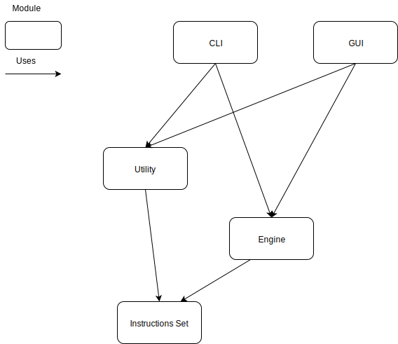

# Interpreter Architecture

## What is this document?

The purpose of this document is to explain how the project, the interpreter, in
its whole is organized.

## Abstract

In order to be able to know how to accomplish a task, we have to take things
apart, create subtasks that we can estimate the magnitude. In this project,
this takes the form of modules. Each module is piece of software that has a
precise role, and that other modules can use.

## The modules

The project is subdivided into 5 submodules, organized like so:

### Engine

The first module is the `Engine`, the central one. It is in charge of
generating a data structure that represents the CHIP-8 environment (memory,
registers, ...), and executing the given instructions.

Read more on this module: [Engine module](./engine.md)

### Instruction Set

The instruction set module is responsible of providing a map of all the
possible CHIP-8 instructions with their associated actions.

Read more on this module: [Instruction Set module](./instruction-set.md)

### Utility

This module is a collection of subroutines that helps to examine CHIP-8 source
code and sanitize it.

Read more on this module: [Utility module](./utility.md)

### CLI

The Command Line Interface is one of our "frontend" module, i.e. one
that user will interact with, not developers. It gives the users the ability to
interact with the engine module through a terminal emulator.

Read more on this module: [The CLI module](./cli.md)

### GUI

Here's the second "frontend" module: the Graphical User Interface. It is in
charge of giving the users a way to interact with the engine module in a
graphical way.

Read more on this module: [The GUI module](./gui.md)
